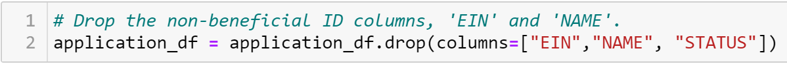
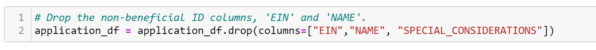
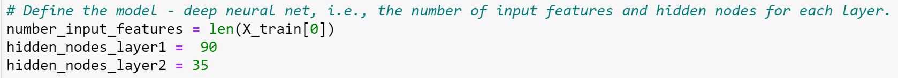

# Neural_Network_Charity_Analysis

## Overview

The purpose of this analysis  was to train a neuro network predicting whether applicants will be successful if funded by Alphabet Soup. This analysis required to manipulate the dataset in order to optimize the neuro network performance.
- - -
## Results
Data Preprocessing
- What variable(s) are considered the target(s) for your model?
  - Answer: 'IS_SUCCESSFUL' column
- What variable(s) are considered to be the features for your model?
   - Answer: '	APPLICATION_TYPE, AFFILIATION,	CLASSIFICATION,	USE_CASE,	ORGANIZATION,	STATUS,	INCOME_AMT,	SPECIAL_CONSIDERATIONS,	ASK_AMT'
- What variable(s) are neither targets nor features, and should be removed from the input data?
   - Answer: 'EIN and	NAME'	

Compiling, Training, and Evaluating the Model

- How many neurons, layers, and activation functions did you select for your neural network model, and why?
   - Answer: I chose 90 for the first layer and 35 for the second layer. I dropped 'Special Consideration' column and chose a 140 for the epoc. This was performed and chosen because after several attempts this gave the best combined loss and accuracy model performance.

Below are the images from the attempts performed for this analysis:

Base line (starting point) loss: .82 accuracy: .53
 
    Attempt 1

Attempt 2

Attempt 3

Attempt 4

Attempt 5

- Were you able to achieve the target model performance?
   - Answer: The target model performance of 75% was not achieved. The best combined model performance after several attempts was at a loss result of .63 and an accuracy result of .68. The closest accuracy to 75% was .71 yet had a loss of .68. 

 

- What steps did you take to try and increase model performance?
   - Answer: The steps taken are summarized by the table below. The best result is colored in red.  
 
 
 
- - - 
## Summary
The summary for this deep learning model analysis had a total of 6 attempts with a manipulation for the number of nodes for both layers, a dropping of 1 column at a time, and changing the number epocs. The best outcome resulted in a loss of .63 and an accuracy of .68.
  
Moving forward to further the analysis in attempting to achieve a better result, I would recommend the random forest model. It is able to achieve comparable predictive accuracy on large tabular data with less code and faster performance. 