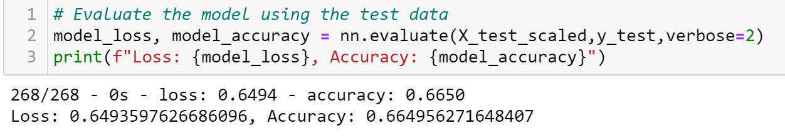

# Neural_Network_Charity_Analysis

## Overview

The purpose of this analysis  was to train a neuro network to predict whether an application is successful or not and to manipulate the dataset to optimize the neuro network performance.
- - -
## Results 
base_result

Data Preprocessing
- What variable(s) are considered the target(s) for your model?
  - mpmpompm
- What variable(s) are considered to be the features for your model?
   - l;jnljkn
- What variable(s) are neither targets nor features, and should be removed from the input data?
   - knnn
- Compiling, Training, and Evaluating the Model
   - lkmlkm
- How many neurons, layers, and activation functions did you select for your neural network model, and why?
   - lnn
- Were you able to achieve the target model performance?
   - kjkjn
- What steps did you take to try and increase model performance?
   - ;lnlkjnkn
 
- - - 
## Summary

Summarize the overall results of the deep learning model. Include a recommendation for how a different model could solve this classification problem, and explain your recommendation.